# Connect your Shopify store in the Quartile LLC

## Shopify API Access

Access your store: https://admin.shopify.com

Enable custom app development from the Shopify admin
Before you can create a custom app for your store, you need to enable custom app development. You need to be the store owner or a staff member with the Enable app development permission to enable custom app development.

Steps:

1.	From your Shopify admin, click on the "**Settings****" 

    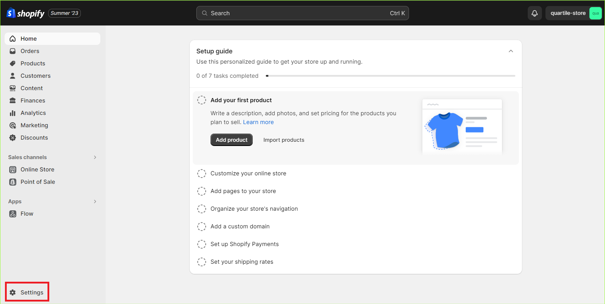

2. Click on the "**Apps and sales channels**"

    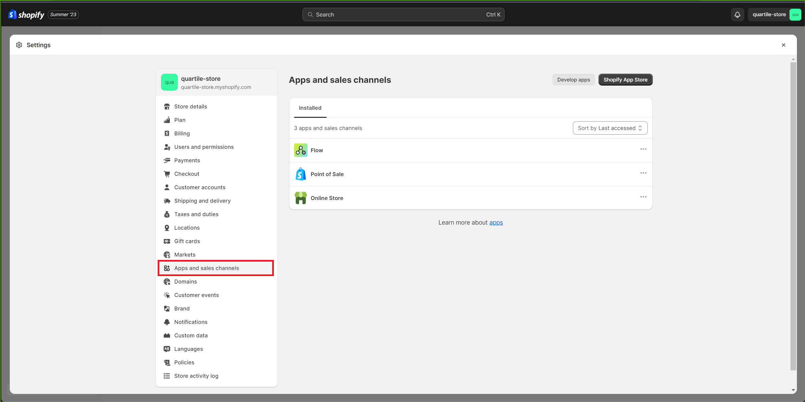

3. Click on the "**Develop apps**" button

    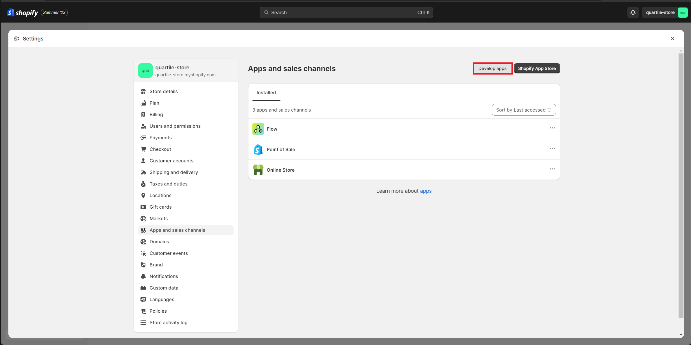

4. Click on the "**Allow custom app development**" button

    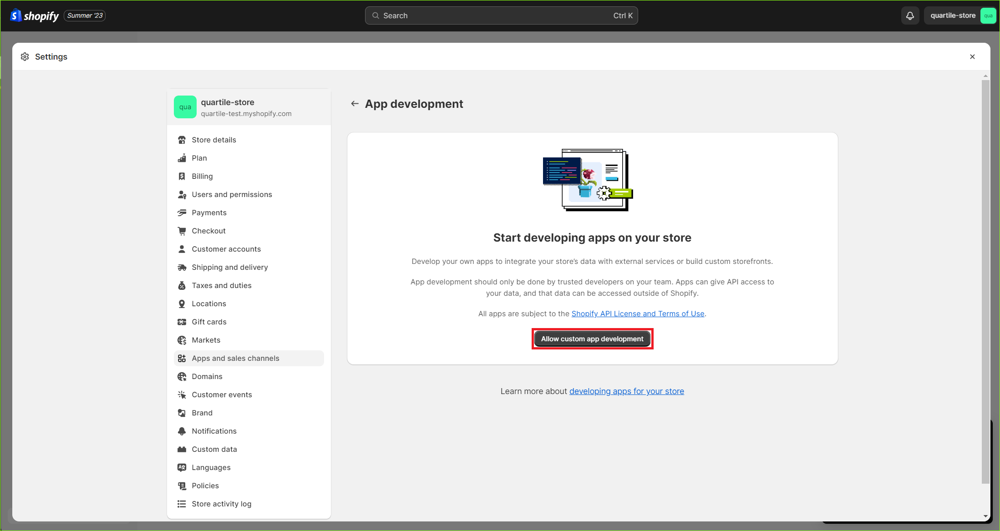

5. Confirm and then click on the "**Allow custom app development**" button

    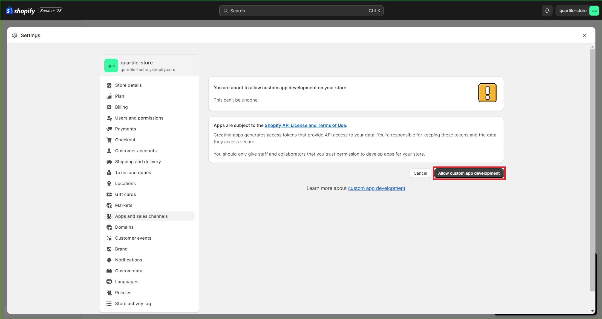

6. Now you can see the "**App setup**" page, click on the "**Create an app**" button

    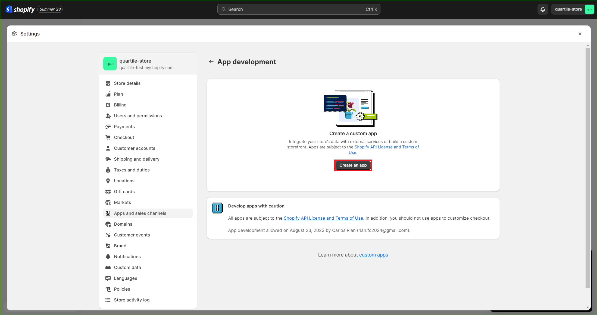

7. Fill in the "**App name**" and click on the "**Create app**" button

    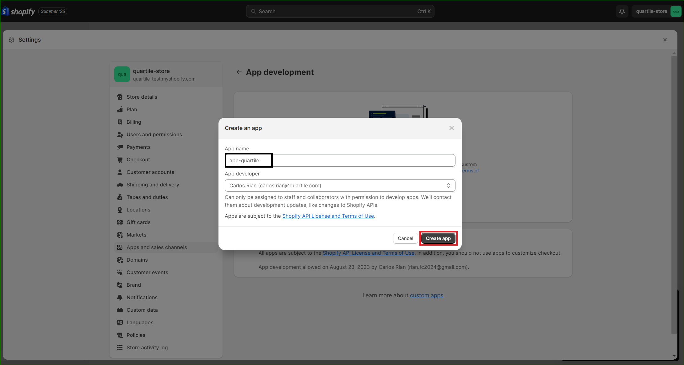

8. Now you can see the "App details" page, click on the "**Configure Admin API Scopes**" button
    
    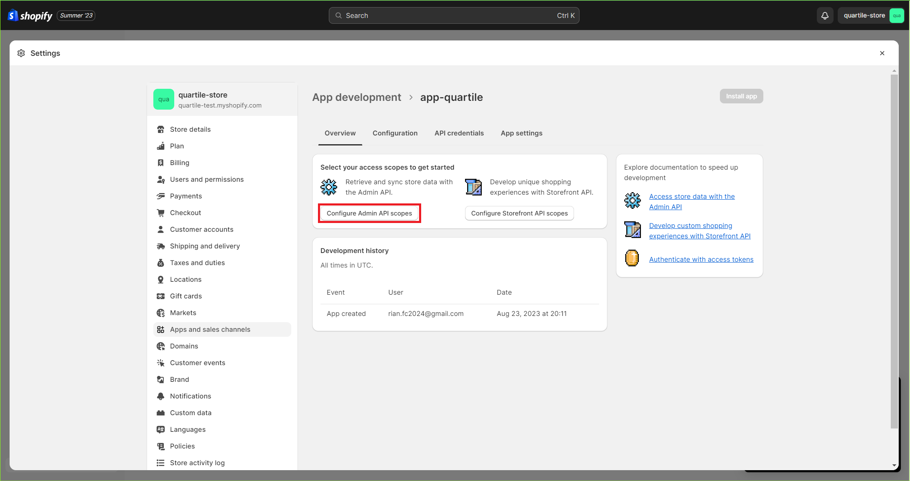

9. Select the access scopes (`read_product_listings`, `read_inventory`, `read_orders`, `read_products`, `read_content`, and `read_script_tags`) and click on the "**Save**" button

    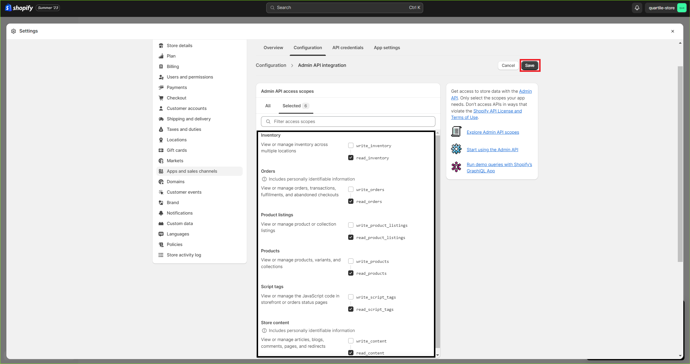

10. Now go to the "**API Credentials**" tab and click on the "**Install app**" button

    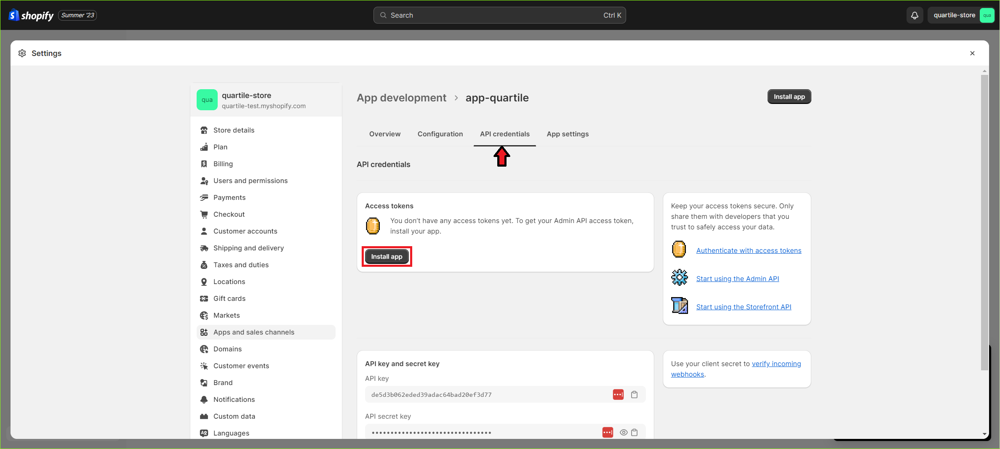

11. Confirm by clicking the "**Install**" button

    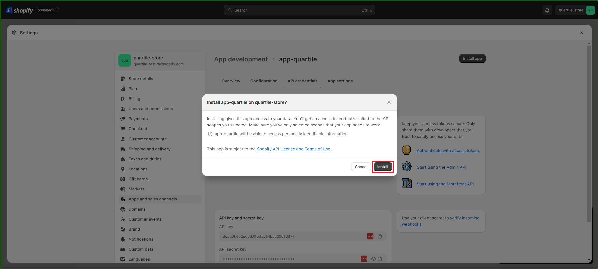

12. Click on the "**Reveal token once**" button

    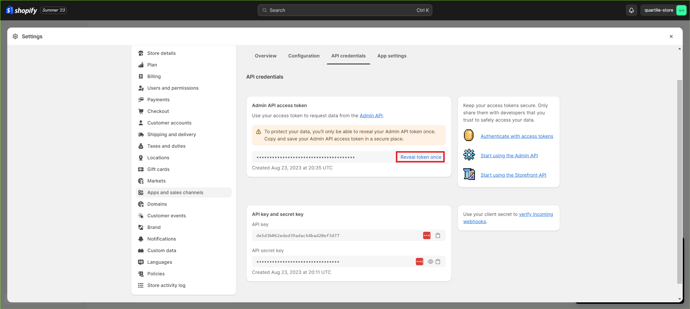

13. Copy the "**Admin API access token**" and save it in a safe place; this token will be used to connect your store to the Quartile LLC; this is the only time you can see this token. If you lose it, you will have to create a new one.

## Connect your store to the Quartile LLC

1. Go to the Quartile Portal...

#TODO: Add the Quartile Portal steps